# MIKE-FIRST v6.0 — Architecture

> **Migration, Intelligence, Compliance, Engineering — Fully Integrated Resilience & Security Toolkit**
> Version 6.0 | February 2026

---

## Platform Vision

MIKE-FIRST v6.0 unifies three enterprise engines — **Auditor**, **Analyzer**, and **Migrator** — into a single multi-cloud platform that provides 1-click compliance audits, guarantees 30% infrastructure cost savings, and executes zero-downtime cloud migrations.

```mermaid
graph TB
    subgraph "MIKE-FIRST v6.0 Platform"
        direction TB
        UI["🖥️ Next.js Dashboard"]
        MCP["🔌 MCP Server (117 tools)"]
        CLI["⌨️ CLI Interface"]

        subgraph "PILLAR 1: AUDITOR"
            A1["ComplianceScanner"]
            A2["GuardianAgent"]
            A3["OneClickAudit"]
            A4["ReportGenerator"]
        end

        subgraph "PILLAR 2: ANALYZER"
            B1["CostOverrunDetector"]
            B2["SecurityRepositioner"]
            B3["RightSizingEngine"]
            B4["ArbitragePlanner"]
        end

        subgraph "PILLAR 3: MIGRATOR"
            C1["UniversalDiscovery"]
            C2["ZeroDowntimeMigrator"]
            C3["TerraformerIntegration"]
            C4["ValidationEngine"]
        end

        CORE["@mike-first/core — Cloud Abstraction Layer"]
    end

    subgraph "Cloud Providers"
        AWS["☁️ AWS"]
        AZURE["☁️ Azure"]
        GCP["☁️ GCP"]
        ONPREM["🏢 On-Prem"]
    end

    subgraph "AI Agents"
        GEMINI["🤖 Gemini 3 Pro"]
        CLAUDE["🤖 Claude 4 Opus"]
        AG["🌐 4× Antigravity"]
        CC["⚡ 4× Claude Code (25ea)"]
    end

    UI --> MCP
    CLI --> MCP
    MCP --> A1 & B1 & C1
    A1 & A2 & A3 & A4 --> CORE
    B1 & B2 & B3 & B4 --> CORE
    C1 & C2 & C3 & C4 --> CORE
    CORE --> AWS & AZURE & GCP & ONPREM
    GEMINI & CLAUDE --> MCP
    AG & CC --> MCP
```



---

## System Architecture

### Three Pillars

| Pillar       | Engine                      | Functions                | Language                   | Goal                                      |
| ------------ | --------------------------- | ------------------------ | -------------------------- | ----------------------------------------- |
| **AUDITOR**  | Compliance & Regulatory     | 9 core + 33 ROI = **42** | TypeScript + Python (NEAT) | 1-click audit in 30 min, zero-error       |
| **ANALYZER** | Infrastructure Intelligence | 9 core + 30 ROI = **39** | TypeScript + Python (NEAT) | 30% savings guarantee, real-time security |
| **MIGRATOR** | Cloud Migration             | 9 core + 30 ROI = **39** | TypeScript (MigrationBox)  | Zero-downtime, 10 weeks → 3 hours         |
| **Total**    |                             | **120 functions**        |                            |                                           |

### Dual-Mode Architecture

```
MIKE_FIRST_MODE=demo    →  LocalStack + mock APIs + pre-recorded data
MIKE_FIRST_MODE=live    →  Real cloud credentials + live API calls
```

Both modes use identical code paths — only the cloud adapter layer differs.

---

### Monorepo Structure

```
mike-first-v6.0/
├── packages/
│   ├── core/               # Shared types, cloud abstraction, config
│   │   ├── src/
│   │   │   ├── cloud/      # AWS/Azure/GCP/OnPrem adapters
│   │   │   ├── types/      # Shared TypeScript interfaces
│   │   │   ├── config/     # Environment, dual-mode toggle
│   │   │   └── utils/      # Validation, logging, crypto
│   │   └── package.json
│   │
│   ├── auditor/            # PILLAR 1: Compliance Engine
│   │   ├── src/
│   │   │   ├── core/       # 9 core functions
│   │   │   ├── compliance/ # Framework scanners (GDPR, SOX, HIPAA...)
│   │   │   ├── guardian/   # Always-on enforcement agent
│   │   │   ├── m365/       # Microsoft 365 audit module
│   │   │   └── reports/    # Report generators
│   │   └── package.json
│   │
│   ├── analyzer/           # PILLAR 2: Intelligence Engine
│   │   ├── src/
│   │   │   ├── core/       # 9 core functions
│   │   │   ├── cost/       # Cost analysis + optimization
│   │   │   ├── security/   # Vulnerability scanning + repositioning
│   │   │   ├── health/     # Infrastructure health monitoring
│   │   │   └── optimization/ # Multi-cloud arbitrage
│   │   └── package.json
│   │
│   ├── migrator/           # PILLAR 3: Migration Engine
│   │   ├── src/
│   │   │   ├── core/       # 9 core functions
│   │   │   ├── discovery/  # Universal infrastructure discovery
│   │   │   ├── planning/   # Migration planning + wave optimization
│   │   │   ├── execution/  # Migration execution + zero downtime
│   │   │   ├── validation/ # Post-migration validation
│   │   │   └── integrations/ # Terraformer, Cloud Foundation Fabric
│   │   └── package.json
│   │
│   ├── dashboard/          # Next.js 15 + React 19 Frontend
│   │   ├── app/            # App router pages
│   │   ├── components/     # shadcn/ui + custom components
│   │   └── package.json
│   │
│   ├── mcp-server/         # Unified MCP Server (117+ tools)
│   ├── localstack/         # LocalStack integration + fixtures
│   ├── serverless/         # Multi-cloud deployment configs
│   ├── terraform/          # IaC + Cloud Foundation Fabric
│   └── cli/                # Command-line interface
│
├── services/               # Python microservices (legacy NEAT code)
│   ├── neat-auditor/       # NEAT Auditor v2 (Python)
│   └── neat-analyzer/      # NEAT Azure Analyzer v2 (Python)
│
├── docker-compose.yml      # Local dev environment
├── pnpm-workspace.yaml     # Monorepo workspace config
├── turbo.json              # Build orchestration
└── .env.example            # Environment template
```

---

### Cloud Abstraction Layer

Every cloud operation goes through a unified interface:

```typescript
interface CloudProvider {
  name: 'aws' | 'azure' | 'gcp' | 'onprem';

  // Discovery
  listResources(filter?: ResourceFilter): Promise<CloudResource[]>;
  getResourceDetails(id: string): Promise<ResourceDetails>;
  getDependencies(id: string): Promise<Dependency[]>;

  // Cost
  getCostData(period: DateRange): Promise<CostReport>;
  getOptimizationRecommendations(): Promise<Optimization[]>;

  // Security
  getSecurityFindings(): Promise<SecurityFinding[]>;
  getComplianceStatus(framework: Framework): Promise<ComplianceResult>;

  // Migration
  exportResource(id: string): Promise<TerraformConfig>;
  importResource(config: TerraformConfig): Promise<ImportResult>;
  validateResource(id: string): Promise<ValidationResult>;
}
```

---

### Distributed Agent Architecture


**Resource Summary**: 4 Antigravity + 100 Claude Code agents = **104 AI agents**, ~50 skills × 4 = ~200 skill instances, ~300 MCPs = ~50,000 tools, $20K token budget.

---

### Key Integrations

| Integration                 | Purpose                            | How                                              |
| --------------------------- | ---------------------------------- | ------------------------------------------------ |
| **LocalStack**              | Demo mode + CI testing             | Docker container emulating 80+ AWS services      |
| **Serverless Framework**    | Multi-cloud function deployment    | Deploy to Lambda/Cloud Functions/Azure Functions |
| **Terraformer**             | Import existing infra as Terraform | Reverse-engineer any cloud into IaC              |
| **Cloud Foundation Fabric** | GCP landing zones                  | Production Terraform modules for GCP             |
| **Gemini Cloud Assist MCP** | AI-powered GCP ops                 | MCP server for Gemini-driven cloud management    |
| **NEAT Auditor (Python)**   | Legacy compliance code             | Python microservice behind REST API              |
| **NEAT Analyzer (Python)**  | Legacy analysis code               | Python microservice behind REST API              |

---

### Security Architecture

- **Credentials**: Never logged, never stored in code. Vault-backed (HashiCorp/Azure Key Vault/GCP Secret Manager)
- **API Security**: Rate limiting + circuit breakers on all external calls
- **Runtime Validation**: Zod schemas at all system boundaries
- **Container Security**: cosign image signing, read-only filesystems
- **Network**: mTLS between all services, private endpoints preferred
- **RBAC**: Least-privilege cloud provider roles (Reader for audit, Contributor for remediation)
